# FlowTopo

[](https://github.com/hellolulujiang/flowtopo/actions/workflows/tests.yml)
[](LICENSE)

Orderings, layerings and partitions for D8 flow networks, in Python.

This is the method and one worked example. The global 90 m products it computes
are released separately on Zenodo, and the companion manuscript is
Jiang et al. (in preparation); both are linked below.

FlowTopo builds reusable structures for a D8 flow network, computed once from
the flow-direction grid and used by any computation over the network:

* **three serial orderings** — a single pass over the cells, one core;
* **three parallel layerings** — independent cells grouped into layers, several
  threads;
* **two spatial partitions** — independent subregions, several processors.

Four kernels come with the package to exercise them — upstream drainage area,
distance to outlet, longest upstream path, Strahler stream order. They are
tests of the structures, not the point of the package: each runs on every
structure and the results are cross-checked.

A narrated video overview of the structures and the propagation manners:
<https://youtu.be/tE5K2wM3TTY>. Every animation below is a preview; the
**▶ HD video** under it opens the full-resolution version, which can be
paused, scrubbed and viewed fullscreen (browser Back returns here). The files
are archived in [`docs/media`](docs/media).

## Serial orderings

An ordering is a topological sort of the valid cells: every cell comes after
the cells it depends on. One pass over the sequence computes any kernel.

| topological sort from the sources<br>`ordering="topo"` | breadth-first from the pit<br>`ordering="bfs"` | depth-first from the pit<br>`ordering="dfs"` |
| :---: | :---: | :---: |
| [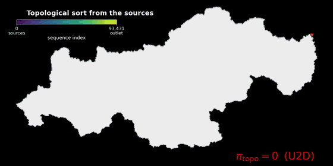](https://github.com/user-attachments/assets/802b448c-46a1-4d7f-a1e3-c2cd1f1c9385) | [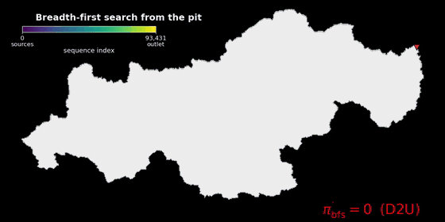](https://github.com/user-attachments/assets/5680a958-2d7e-4003-80af-0a1ac4ab769e) | [](https://github.com/user-attachments/assets/0f48bc7a-98f2-4948-ae02-8769db772250) |
| a cell is appended once all its donors are done | cells in order of hop count from the pit | one tributary subtree at a time |
| [▶ HD video](https://github.com/user-attachments/assets/802b448c-46a1-4d7f-a1e3-c2cd1f1c9385) | [▶ HD video](https://github.com/user-attachments/assets/5680a958-2d7e-4003-80af-0a1ac4ab769e) | [▶ HD video](https://github.com/user-attachments/assets/0f48bc7a-98f2-4948-ae02-8769db772250) |

The three differ in memory access pattern. Depth-first has the lowest simulated
L1 miss rate on the example basin: 10.55%, against 21.83% (breadth-first) and
37.02% (topological sort).

**Direction.** An ordering is built in one direction and reversed on demand.
Depth-first and breadth-first start at the pit, so they come out downstream to
upstream (`d2u`, position 0 is a pit); the topological sort starts at the
headwaters, so it comes out upstream to downstream (`u2d`, position 0 is a
headwater). The two are reverses of each other.

Which one a kernel needs follows from the way its values travel. Drainage area,
longest upstream path and Strahler order accumulate **into** the receiver and
need `u2d`; distance to outlet reads **from** the receiver and needs `d2u`. The
kernels flip the sequence for you, so `topo.upstream_area(ordering="dfs")`
walks the depth-first order upstream to downstream even though it was built the
other way. Ask for a direction explicitly with
`topo.ordering("dfs", "u2d")`.

## Parallel layerings

A layering assigns every cell a layer index such that cells in the same layer
are independent of each other. Layers run in order; cells within a layer run
in parallel. Layer 0 holds the headwaters.

| as soon as possible<br>`layering="asap"` | conflict-free downstream<br>`layering="cfds"` | as late as possible<br>`layering="alap"` |
| :---: | :---: | :---: |
| [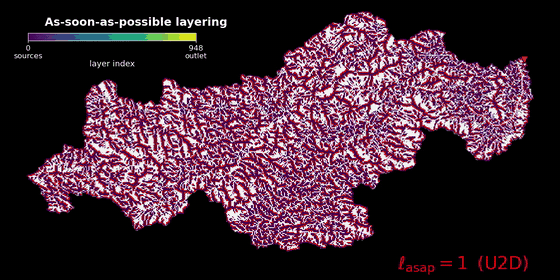](https://github.com/user-attachments/assets/b204458c-1dbf-4cac-ac2b-a5bee193eb79) | [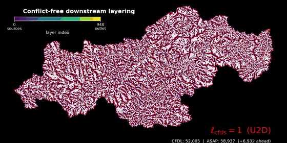](https://github.com/user-attachments/assets/c7df9a2f-8ec4-475d-b9ed-c963ef762d54) | [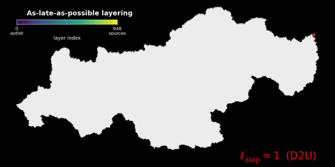](https://github.com/user-attachments/assets/4407d9af-47e6-4fcc-b409-ea4bf850d3ff) |
| every cell in the earliest layer its donors allow | as soon as possible, plus one rule: no two cells in a layer share a receiver | every cell in the latest layer possible |
| [▶ HD video](https://github.com/user-attachments/assets/b204458c-1dbf-4cac-ac2b-a5bee193eb79) | [▶ HD video](https://github.com/user-attachments/assets/c7df9a2f-8ec4-475d-b9ed-c963ef762d54) | [▶ HD video](https://github.com/user-attachments/assets/4407d9af-47e6-4fcc-b409-ea4bf850d3ff) |

The minimum layer count is set by the longest flow path. The conflict-free rule
may add a few layers; on the example basin it adds none (949 layers for all
three).

Layerings are built `u2d`, layer 0 at the headwaters. The downstream-propagating
kernel needs them the other way round, and flips them itself;
`topo.decomposition("cfds", "d2u")` gives that view directly.

## Spatial partitions

A layering spreads work across threads that share memory. Splitting the network
across processors needs a second cut, along the drainage hierarchy, so that no
value crosses a subregion boundary while a kernel runs.

Set `n_parts` to the number of processors: one subregion each, so a subregion's
working set stays in its own memory. The paper's benchmark uses four, because
the server has four Xeon Platinum 8270 processors, each a NUMA node with 26
cores, and runs about 13 threads inside each subregion.

[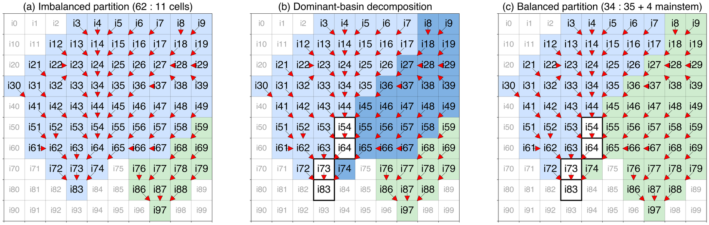](docs/media/partition_schematic.png)

*Two basins mapped onto two subregions.* `level="basin"` keeps each basin
whole, so the 62-cell basin and the 11-cell basin cannot be balanced.
`level="subbasin"` walks up the dominant basin's mainstem, and a tributary
subtree moves to the lighter subregion.

Whole basins cannot be split, so one large basin leaves the other processors
idle. The bundled example is a single basin, which makes the point exactly:

```python
topo.partition(n_parts=4, level="basin")[1]      # [93432, 0, 0, 0]
topo.partition(n_parts=4, level="subbasin")[1]   # [23121, 23121, 23121, 23120]
```

Subbasin-level walks upstream from the outlet, taking the larger tributary at
each confluence. That isolates the mainstem; the tributary subtrees hanging off
it are dealt to the lighter subregions, and the mainstem runs in a second stage
once they finish. Its cells are marked `flowtopo.MAINSTEM`.

## Write conflicts

Whichever structure carries the traversal, a kernel still has to move a value
from a cell to its receiver. There are three ways to do it:

| pull | atomic push | push |
| :---: | :---: | :---: |
| [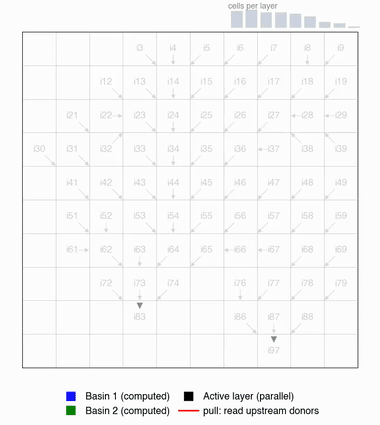](https://github.com/user-attachments/assets/c897fd03-b2dd-4371-aba8-cd2bd0692857) | [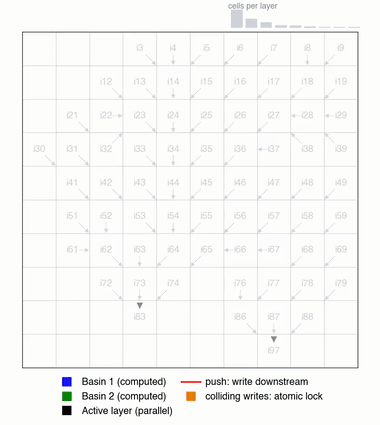](https://github.com/user-attachments/assets/f988af11-ce25-4fb4-9edd-1bfa5b025dde) | [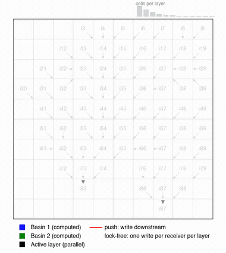](https://github.com/user-attachments/assets/35cad382-2d3c-4378-aab4-7df1c9fc5384) |
| each receiver reads its donors; needs the upstream table | donors write through atomics; correct, but float sums are not reproducible | donors write directly; deterministic, no locks; requires the conflict-free layering |
| [▶ HD video](https://github.com/user-attachments/assets/c897fd03-b2dd-4371-aba8-cd2bd0692857) | [▶ HD video](https://github.com/user-attachments/assets/f988af11-ce25-4fb4-9edd-1bfa5b025dde) | [▶ HD video](https://github.com/user-attachments/assets/35cad382-2d3c-4378-aab4-7df1c9fc5384) |

A push is only safe if no two cells in a layer write to the same receiver.
Conflict counts on the example basin (93,432 cells):

| layering | conflicting writes inside a layer |
| --- | --- |
| as soon as possible | 12,122 |
| **conflict-free downstream** | **0** |
| as late as possible | 39,130 |

The count is a property of the layering and can be checked before running. A
test run is not a reliable check: a race does not always trigger. Strahler
order has no atomic form, because its confluence rule is a comparison rather
than an addition, so its only parallel push is under the conflict-free
layering.

Because no two cells in a layer share a receiver, the sums always happen in the
same order: the conflict-free push returns bit-identical results at any thread
count, which an atomic push cannot promise. If `manner` is not given, FlowTopo
picks a safe one for the layering.

## Which structure to use

From the paper's benchmark on the full 90 m network (22.2 billion cells,
65 regions):

* **One sweep, one core** — the depth-first ordering. Up to 5.1× faster than
  the slowest serial ordering; subtree contiguity drops the L3 miss rate from
  37% to about 6%. It is also the baseline to measure parallel speedup
  against; a slower baseline overstates the speedup.
* **Repeated traversal** (calibration, ensembles) — the as-late-as-possible
  layering with pull. Fastest in parallel: each layer's working set stays in
  cache. Pull must store the donor table.
* **Non-linear kernels, or when RAM is tight** — the conflict-free downstream
  layering with push. Lock-free and deterministic, stores only the receiver
  pointer, and the only parallel option for Strahler order.
* **Across processors** — the subbasin partition, run at about 13 threads each,
  beyond which memory bandwidth rather than the algorithm bounds the speedup.

The structures are computed once from the static D8 field and reused without
limit.

## Install

```sh
pip install -e .            # numpy + rasterio
pip install -e ".[speed]"   # + numba, for threaded kernels
```

Requires Python ≥ 3.10, the versions the tests run on. Without numba
everything still runs, in pure Python.

## Quick start

```python
import flowtopo

topo = flowtopo.FlowTopo.from_raster("data/dir_example.tif")

upa = topo.upstream_area(ordering="dfs")                      # serial
upa = topo.upstream_area(layering="cfds", manner="push")      # a layer at a time
ldn = topo.distance_to_outlet(ordering="dfs")
lup = topo.longest_upstream_path(ldn, ordering="dfs")
strord = topo.strahler_order(ordering="dfs",
                             channel_mask=topo.channel_mask(upa, 10.0))

part, load = topo.partition(n_parts=4, level="subbasin")      # across processors

topo.to_2d(upa)                                               # back on the grid
```

With numba, the same kernels with threads:

```python
from flowtopo import parallel
upa = parallel.upstream_area(topo, layering="cfds", manner="push")
```

Run everything on the example basin:

```sh
python example.py       # every structure, kernel and manner; ends PASS or FAIL
python benchmark.py     # serial vs threaded at several grid sizes
```

## Documentation

* [`docs/user-guide.md`](docs/user-guide.md) — choosing an ordering, a layering
  and a manner; threads; raster I/O.
* [`docs/methods.md`](docs/methods.md) — each method with its origin and its
  complexity.
* [`examples/quickstart.ipynb`](examples/quickstart.ipynb) — a notebook on the
  bundled data, stored with its output so it reads without running anything.
* [`docs/review-checklist.md`](docs/review-checklist.md) — what has been
  checked and how, the bugs those checks found, and the angles still
  unattacked.

## Example data

`data/dir_example.tif` is the example basin of the paper: 614 × 292 cells at
3 arc-seconds, 93,432 valid, 731 km², cut from
[MERIT Hydro](https://doi.org/10.1029/2019WR024873) (Yamazaki et al., 2019).
The GeoJSON files are the basin boundary and the outlet.

Any D8 GeoTIFF in the same convention works: codes are powers of two clockwise
from east, with 0 and 255 terminal. The file's own nodata value is honoured
too, which matters because 255 means a terminal here, not nodata.

```sh
python example.py --data my_dir.tif
```

## Getting the input data

The structures are indexed against the MERIT Hydro 90 m flow-direction grid,
cell for cell. To recompute anything, or to use a released structure on real
data, you need that grid, and it is **not redistributed here**: get it from its
authors at <http://hydro.iis.u-tokyo.ac.jp/~yamadai/MERIT_Hydro/>, under the
CC BY-NC 4.0 terms they set. Only the 731 km² example basin travels with this
repository, under the same terms.

The global grid spans 180° W to 180° E and 85° N to 60° S: about 174,000 rows
by 432,000 columns, 75.17 billion cells, of which 22.24 billion are land. It is
distributed as 5° × 5° tiles.

Two ways to work with it:

**A region at a time.** Mosaic the tiles that cover one of the 65 hydrological
regions and run the structures on that. A region encloses only complete basins
and stays within 38° × 38°, which keeps its cell indices inside 32-bit
integers — the same reason this package uses int32 throughout. The region
boundaries come from MERIT-FullBasin, below.

```python
import flowtopo
topo = flowtopo.FlowTopo.from_raster("region43_dir.tif")
upa  = topo.upstream_area(ordering="dfs")
```

**One basin at a time.** Clip whatever basin you care about, as the bundled
example was clipped, and run the same code. A clipped subset stays valid:
removing downstream cells does not change what its upstream cells depend on.

Whole basins or whole regions, never an arbitrary rectangle — a cut through
the middle of a basin turns the cells on the cut into pits, and the drainage
area beyond it is simply gone.

## Global products

This repository holds the method and one example basin. Applied to the whole
90 m MERIT Hydro network, it produces two Zenodo records, both as per-region
GeoTIFFs for 65 regions.

### The structures

**MERIT-FlowTopo** ([10.5281/zenodo.20653059](https://doi.org/10.5281/zenodo.20653059))
holds the traversal structures themselves. Every region carries the
depth-first sequence, the conflict-free downstream and as-late-as-possible
layerings, and the subbasin partition; Region 43 (South China) carries all
eight, so the alternatives can be compared somewhere. 978 GB uncompressed,
49 GB compressed.

[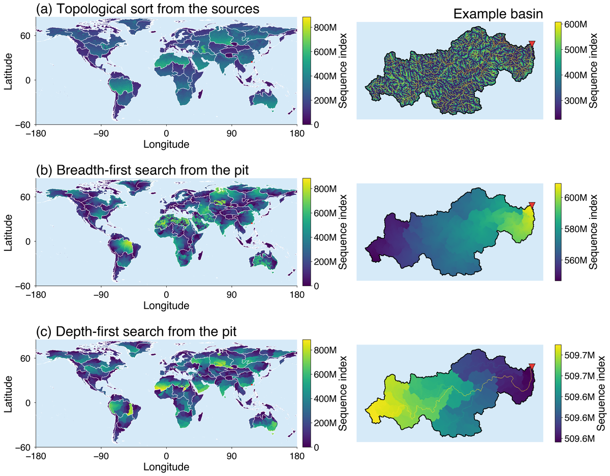](docs/media/global_orderings.png)

[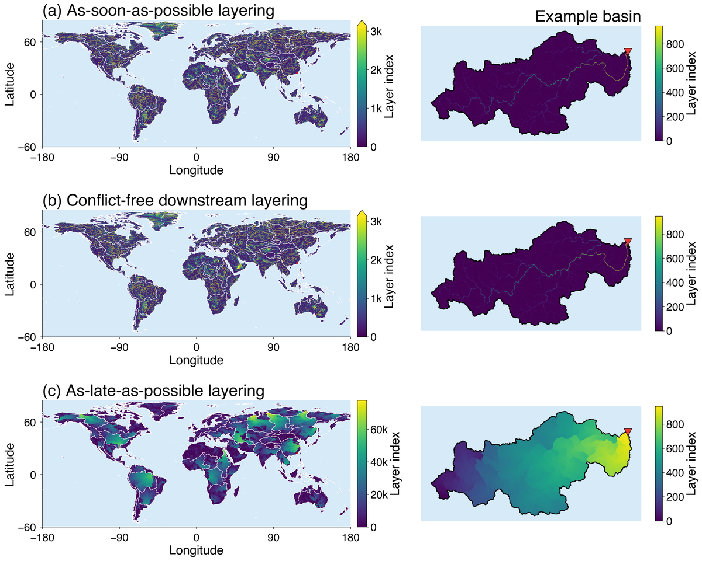](docs/media/global_layerings.png)

[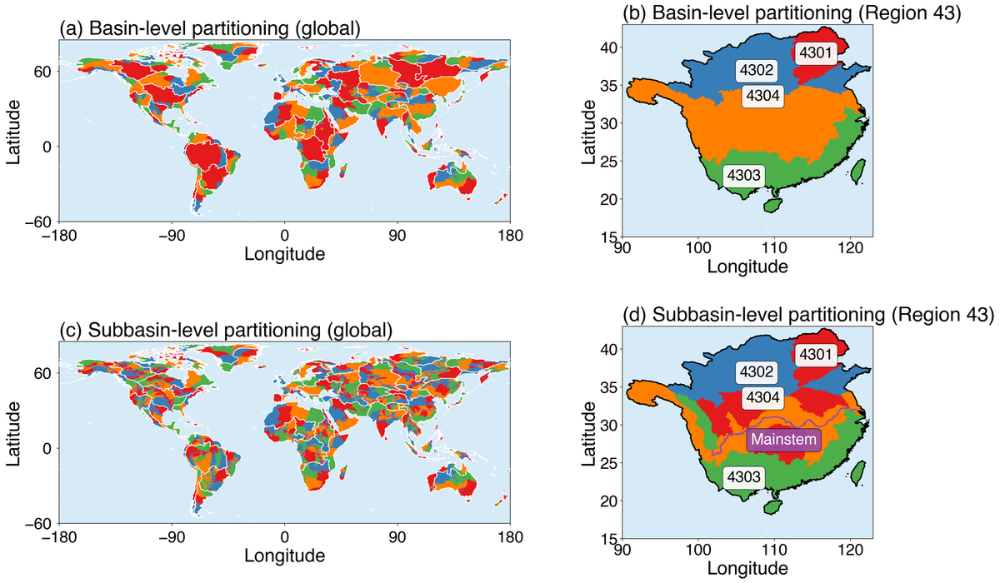](docs/media/global_partitions.png)

*The eight structures over the whole network: three serial orderings, three
parallel layerings, two spatial partitions.*

Because the D8 field does not change, these are computed once and reused
without limit. That is the point: a cost every tool currently pays on every
run becomes a read.

### What the structures compute

**MERIT-DrainAttr** ([10.5281/zenodo.20686665](https://doi.org/10.5281/zenodo.20686665))
is the four kernels run over those structures: a baseline, so the variables
almost everyone wants need not be recomputed either.

[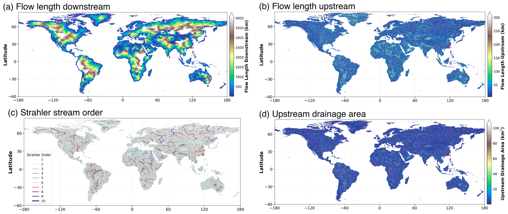](docs/media/kernel_products.png)

Flow length downstream, flow length upstream and Strahler stream order for
every region; upstream drainage area for Region 43 only, since MERIT Hydro
already distributes it globally. 622 GB uncompressed, 60 GB compressed.

Anything else is one pass over a structure you already have: a different
accumulation, a routing state, a variable nobody has asked for yet. That is
why the release is the structures and not the variables.

### The input partition

**MERIT-FullBasin** ([10.5281/zenodo.20344113](https://doi.org/10.5281/zenodo.20344113))
divides the network into the 65 hydrologically independent regions everything
above is organised by. It comes from the companion dataset, not from here.

## Acknowledgements

**MERIT Hydro** (Yamazaki et al., 2019;
[10.1029/2019WR024873](https://doi.org/10.1029/2019WR024873)) provides the
flow-direction field everything here traverses: the example basin is cut from
it, and the global products are built on its 90 m network. The bundled excerpt
keeps its CC BY-NC 4.0 terms.

The representation this package works on comes from
[pyflwdir](https://github.com/Deltares/pyflwdir) (D. Eilander, Deltares and the
Institute for Environmental Studies, Vrije Universiteit Amsterdam; MIT licence;
[10.5281/zenodo.4287337](https://doi.org/10.5281/zenodo.4287337)). What FlowTopo
takes from it:

* **the flat downstream-pointer array** — for every cell, the linear index of
  the cell it drains into, with a pit pointing at itself. Every structure and
  every kernel here is derived from that one array;
* **the D8 decoding conventions** — codes as powers of two clockwise from east,
  0 and 255 terminal, 247 nodata, and a cell draining off the grid or into
  nodata treated as a pit;
* **the donor-count array** and its sentinel convention;
* **the chain-tracing rank and the breadth-first sequence builder**, which
  appear here in the variants set out in [`docs/methods.md`](docs/methods.md).

No pyflwdir source is included. The code here was written against those
conventions rather than copied from them, and `FlowTopo.from_d8` takes the same
array `pyflwdir.from_array(d8, ftype="d8")` takes, so the two read the same
rasters.

The three layerings, the conflict-free downstream rule, the propagation
manners, the locality metrics and the benchmark drivers are this project's own.

**Claude** (Anthropic) helped prepare this repository: the Python
implementation, the tests, the documentation and the packaging were drafted
with it and checked by the authors, and the commit history records where. The
structures, the algorithms and the results they produce are the authors' own
work, described in the companion manuscript.

## Verification

Expected outputs for the example basin are stored with the tests, so a fresh
clone verifies itself:

```sh
pytest
```

86 tests. Every ordering, layering, partition, kernel and manner is
cross-checked on the example basin, write-conflict counts included. Degenerate
inputs get their own: an empty grid, a lone cell, networks with cycles. So do
the API's promises — cached arrays are read-only, repeated calls agree bit for
bit, accumulation keeps the precision it was given.

Those tests and `example.py` run on Python 3.10, 3.11 and 3.12 on every push.
The badge at the top links to the runs.

## Contact

Questions, problems and suggestions are welcome by email —
<lulu_jiang@pku.edu.cn> — or as a
[GitHub issue](https://github.com/hellolulujiang/flowtopo/issues). Email is the
surer way to reach us.

## Citing

The companion manuscript is *MERIT-FlowTopo v1.0: a reusable computational
foundation for hyperresolution hydrology on the global 90 m drainage network*
(Jiang et al., in preparation). A citation file will be added once it appears;
until then, cite the manuscript.

## Licence

MIT for the code. The bundled MERIT Hydro excerpt keeps its own CC BY-NC 4.0
terms; see [`LICENSE`](LICENSE).
