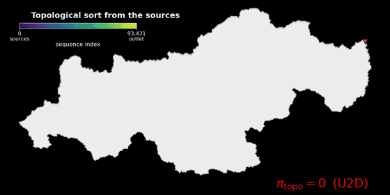
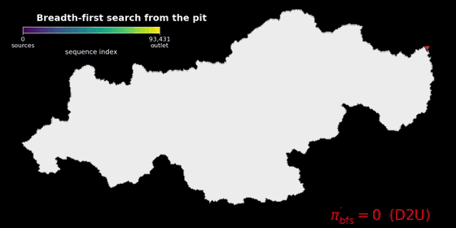
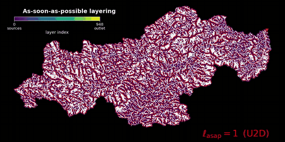
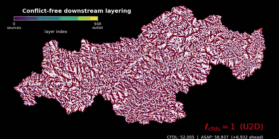
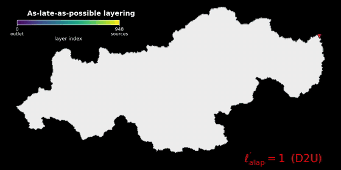
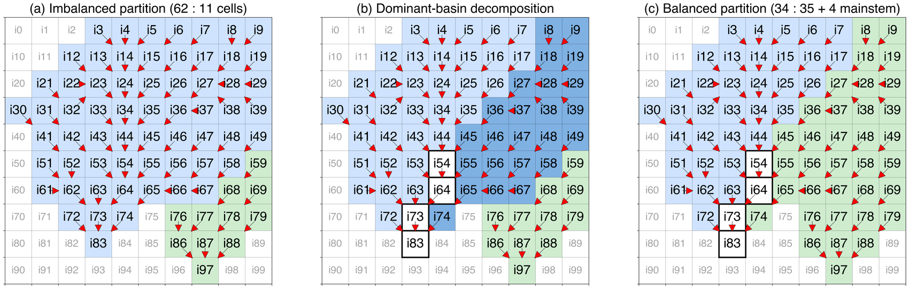
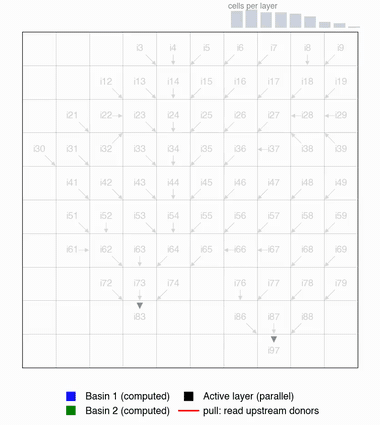
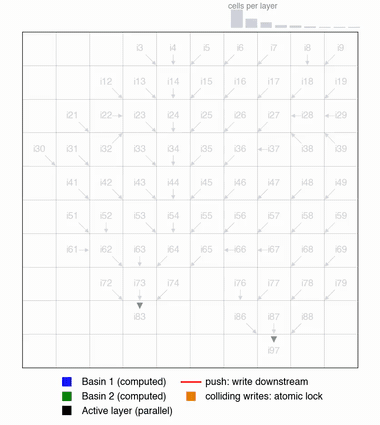
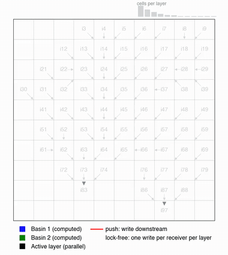

# FlowTopo

[](https://github.com/hellolulujiang/flowtopo/actions/workflows/tests.yml)
[](LICENSE)

Orderings, layerings and partitions for D8 flow networks, in Python.

A D8 flow-direction grid fixes which cells must be done before which: a cell
needs its upstream neighbours first, or, for some kernels, its downstream one.
FlowTopo works that order out once, from the grid alone, and saves it.
Anything that walks the network in drainage order (upstream drainage area,
flow length, Strahler stream order, or the upstream-to-downstream step of a
routing scheme)
then reads the saved order instead of working it out again.

This repository is the Python reference implementation with one example
basin. The structures for the 90 m MERIT Hydro network are on Zenodo
([Global products](#global-products)). The companion paper (Jiang et al.) has
been submitted to Geoscientific Model Development. A ten-minute narrated
video shows the structures and the three ways of moving a value to its
receiver: <https://youtu.be/tE5K2wM3TTY>.

Documentation, the global MERIT Hydro products and the other FullHydro tools:
<https://fullhydro.org/tools/flowtopo/>

Author: Lulu Jiang (<https://lulujiang.me>)

## Install

```sh
git clone https://github.com/hellolulujiang/flowtopo.git
cd flowtopo
pip install -e .            # numpy + rasterio: structures and serial kernels
pip install -e ".[speed]"   # adds numba: the threaded kernels need it
```

Python 3.10 or newer. Without numba the structures and the serial kernels
still run, in pure Python; `flowtopo.parallel` raises an error.

## Quick start

```python
import flowtopo

topo = flowtopo.FlowTopo.from_raster("data/dir_example.tif")

upa = topo.upstream_area(ordering="dfs")           # km², one serial pass
ldn = topo.distance_to_outlet(ordering="dfs")      # flow length downstream, m
strord = topo.strahler_order(                      # on cells draining ≥ 10 km²
    ordering="dfs", channel_mask=topo.channel_mask(upa, 10.0))

upa_grid = topo.to_2d(upa)                         # back on the raster grid
```

Three of the kernels also run on threads, a layer at a time (needs numba);
Strahler stream order runs serially only:

```python
from flowtopo import parallel
upa = parallel.upstream_area(topo, layering="cfds", manner="push")   # push is safe only under cfds
```

## Example data

`data/dir_example.tif` is the example basin of the paper: 292 rows by 614
columns at 3 arc-seconds, 93,432 valid cells, 731 km², cut from
[MERIT Hydro](https://doi.org/10.1029/2019WR024873) (Yamazaki et al., 2019)
and kept under its CC BY-NC 4.0 terms ([`DATA_NOTICE.md`](DATA_NOTICE.md)).
The GeoJSON files are the basin boundary and the outlet.

Any D8 GeoTIFF in the MERIT Hydro convention works; see the [user guide](docs/user-guide.md#your-own-grid).

## What you get

Eight structures, grouped by the question each one answers, and three ways
to pass a value from a cell to its receiver. All are built from the D8 grid.
The six orderings and layerings run on the bundled example basin, the three
manners on a small grid of two basins; click one for the
full-size MP4, or see all nine on the
[animation page](https://hellolulujiang.github.io/flowtopo/).

### One core: in what order?

*Three serial orderings. One pass over any of them computes a kernel. They differ in memory access, and so in speed.*

<table>
<tr><th align="center">topological sort from the sources<br><code>ordering="topo"</code></th><th align="center">breadth-first from the pit<br><code>ordering="bfs"</code></th><th align="center">depth-first from the pit<br><code>ordering="dfs"</code></th></tr>
<tr><td align="center"><a href="https://hellolulujiang.github.io/flowtopo/media/seq_topo.mp4"></a></td><td align="center"><a href="https://hellolulujiang.github.io/flowtopo/media/seq_bfs.mp4"></a></td><td align="center"><a href="https://hellolulujiang.github.io/flowtopo/media/seq_dfs.mp4"></a></td></tr>
<tr><td valign="top" align="center">a cell is appended once all its donors are done</td><td valign="top" align="center">cells in order of hop count from the pit</td><td valign="top" align="center">one tributary subtree at a time; best cache locality</td></tr>
</table>

### Many threads: which cells together?

*Three parallel layerings. Layers run in order; the cells of one layer run at the same time.*

<table>
<tr><th align="center">as-soon-as-possible<br><code>layering="asap"</code></th><th align="center">conflict-free downstream<br><code>layering="cfds"</code></th><th align="center">as-late-as-possible<br><code>layering="alap"</code></th></tr>
<tr><td align="center"><a href="https://hellolulujiang.github.io/flowtopo/media/lyr_asap.mp4"></a></td><td align="center"><a href="https://hellolulujiang.github.io/flowtopo/media/lyr_cfds.mp4"></a></td><td align="center"><a href="https://hellolulujiang.github.io/flowtopo/media/lyr_alap.mp4"></a></td></tr>
<tr><td valign="top" align="center">every cell in the earliest layer its donors allow</td><td valign="top" align="center">as-soon-as-possible, plus: no two cells in a layer share a receiver</td><td valign="top" align="center">every cell as late as the longest flow path allows; the most evenly filled layers in practice</td></tr>
</table>

### Several processors: which cells where?

*Two spatial partitions, one subregion per processor. Both cut along the drainage hierarchy, so no value crosses a boundary while a kernel runs.*

<p align="center"><a href="docs/media/partition_schematic.png"></a></p>

<p align="center"><i>Two basins onto two subregions: (a) whole basins, unbalanced; (b) the dominant basin cut along its mainstem, a tributary subtree moved; (c) balanced.</i></p>

<table>
<tr><th align="center" width="50%">basin-level<br><code>level="basin"</code></th><th align="center" width="50%">subbasin-level<br><code>level="subbasin"</code></th></tr>
<tr><td align="center">whole basins go to subregions; a dominant basin cannot be balanced</td><td align="center">the dominant basin is cut along its mainstem; its tributary subtrees balance the load, and the mainstem runs in a separate stage</td></tr>
</table>

### At a confluence: how does a value reach the receiver?

*Three propagation manners. The structure decides when a cell runs; the manner decides who writes the result.*

<table>
<tr><th align="center">pull<br><code>manner="pull"</code></th><th align="center">atomic push<br><code>manner="atomic_push"</code></th><th align="center">push<br><code>manner="push"</code></th></tr>
<tr><td align="center"><a href="https://hellolulujiang.github.io/flowtopo/media/manner_pull.mp4"></a></td><td align="center"><a href="https://hellolulujiang.github.io/flowtopo/media/manner_atomic_push.mp4"></a></td><td align="center"><a href="https://hellolulujiang.github.io/flowtopo/media/manner_push.mp4"></a></td></tr>
<tr><td valign="top" align="center">each receiver reads its donors and writes only itself; needs the donor table</td><td valign="top" align="center">donors write through atomics; correct, but float sums are not reproducible</td><td valign="top" align="center">donors write directly; deterministic, no locks; safe only under <code>cfds</code></td></tr>
</table>


## Global products

The same methods, run with the C implementation over the 90 m MERIT Hydro network, are on Zenodo:

* **MERIT-FlowTopo** — the structures, per region ([10.5281/zenodo.20653059](https://doi.org/10.5281/zenodo.20653059))
* **MERIT-DrainAttr** — flow length downstream and upstream, Strahler order ([10.5281/zenodo.20686665](https://doi.org/10.5281/zenodo.20686665))
* **MERIT-FullBasin** — the regions they are computed on ([10.5281/zenodo.20344113](https://doi.org/10.5281/zenodo.20344113))
* **MERIT-FlowTopo code** — the C code, the figure scripts and an archived copy of this package ([10.5281/zenodo.22227621](https://doi.org/10.5281/zenodo.22227621))

[](docs/media/global_orderings.png)

*The three serial orderings over the 65 continental regions and in the example basin: (a) topological sort from the sources, (b) breadth-first from the pit, (c) depth-first from the pit.*

Maps of the layerings, the partitions and the kernel products, which structure to use when, and how to use the
released structures with the MERIT Hydro grid: [user guide](docs/user-guide.md#global-products).

## Documentation

* [`docs/user-guide.md`](docs/user-guide.md) — choosing an ordering, a layering
  and a manner; threads; raster I/O.
* [`docs/methods.md`](docs/methods.md) — each method with its origin and its
  complexity, and what is borrowed from pyflwdir.
* [`examples/quickstart.ipynb`](examples/quickstart.ipynb) — a notebook on the
  bundled data, stored with its output.

## Tests

```sh
pytest                  # needs pytest; numba for the threaded tests
python example.py       # every structure, kernel and manner on the example basin; ends PASS or FAIL
python benchmark.py     # serial vs threaded on synthetic grids
```

## Citing

The companion manuscript is *MERIT-FlowTopo v1.0: a reusable computational
foundation for hyperresolution hydrology on the global 90 m drainage network*
(Jiang et al., submitted to Geoscientific Model Development); a citation
file will be added once it appears. Until then cite the code record
[10.5281/zenodo.22227621](https://doi.org/10.5281/zenodo.22227621), or this
repository with the commit you used; for a downloaded product cite its version
DOI above.

## Acknowledgements

**MERIT Hydro** (Yamazaki et al., 2019;
[10.1029/2019WR024873](https://doi.org/10.1029/2019WR024873)) is the
flow-direction grid everything here runs on.

The flat downstream-pointer representation, the D8 decoding conventions, the
donor-count array, the chain-tracing rank and the breadth-first sequence
builder follow [pyflwdir](https://github.com/Deltares/pyflwdir) (D. Eilander,
Deltares; MIT licence;
[10.5281/zenodo.4287337](https://doi.org/10.5281/zenodo.4287337)). No pyflwdir
source is included; the code was written against those conventions, and
`FlowTopo.from_d8` takes the same array `pyflwdir.from_array(d8, ftype="d8")`
takes. The borrowed and the original parts are set out in
[`docs/methods.md`](docs/methods.md).

## Contact

<lulu_jiang@pku.edu.cn>, or a
[GitHub issue](https://github.com/hellolulujiang/flowtopo/issues). Email
reaches us faster.

## Licence

MIT for the code; see [`LICENSE`](LICENSE). The bundled MERIT Hydro excerpt keeps
its own CC BY-NC 4.0 terms; see [`DATA_NOTICE.md`](DATA_NOTICE.md).
