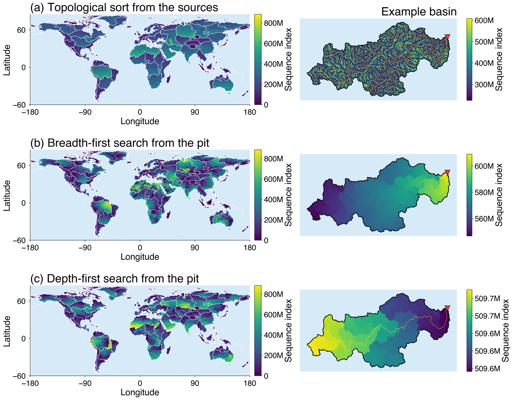
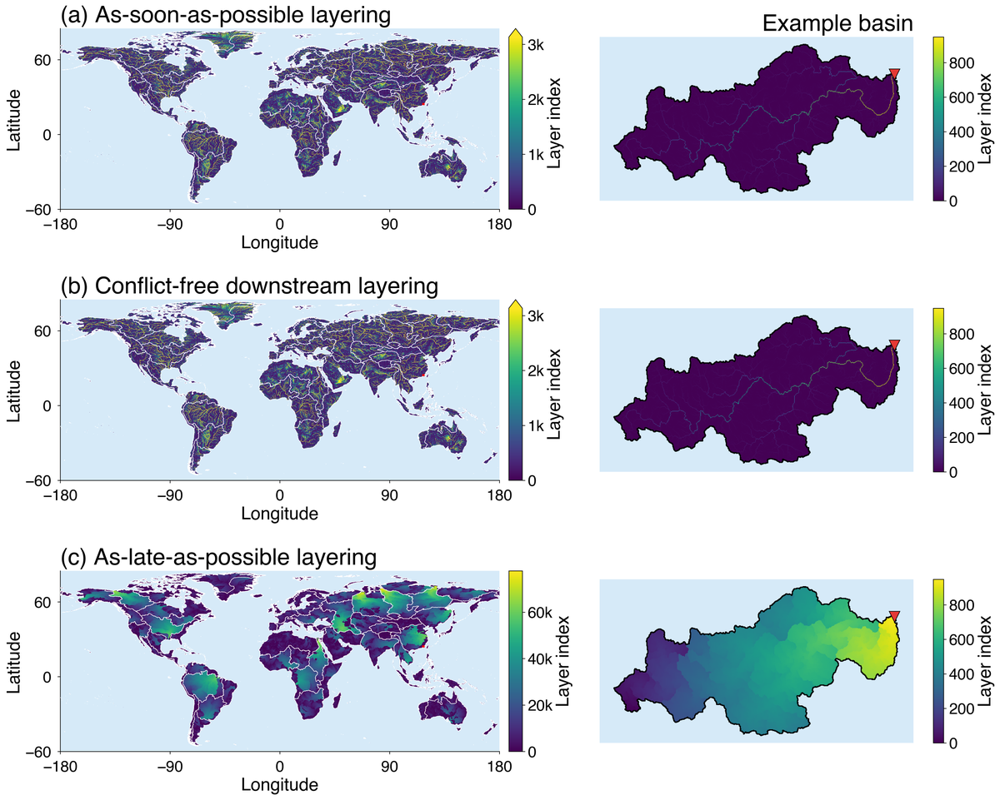
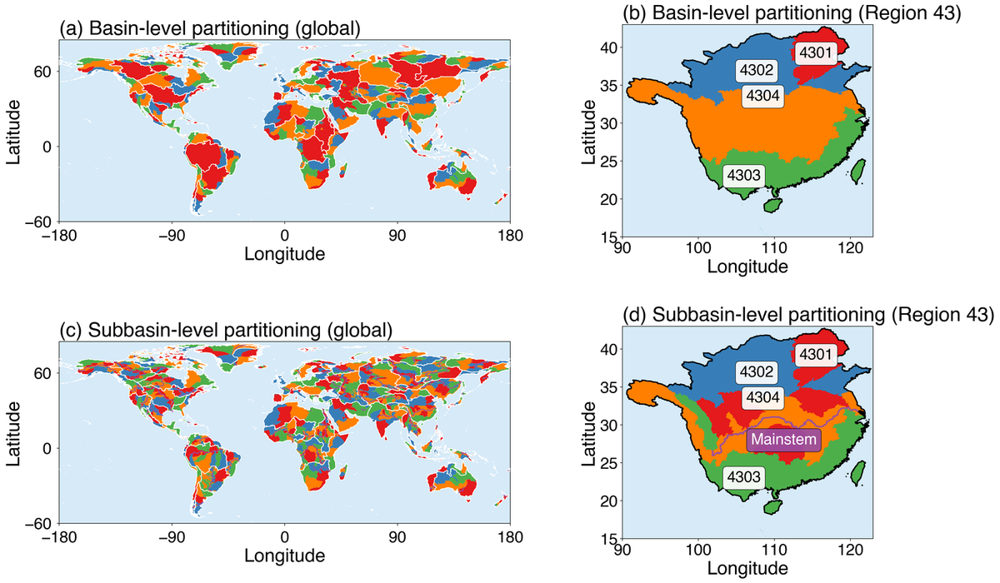
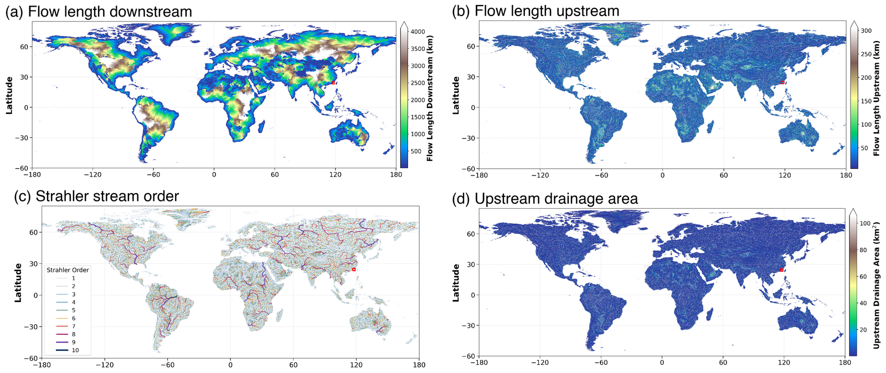

# User guide

## What this package is for

You have a D8 flow-direction raster and you want to compute something that
travels along the network: drainage area, distance to the outlet, stream order.
Every such computation needs the cells visited in an order that respects the
flow, and there is more than one such order. This package builds six of them
and runs four kernels over any of them, so you can pick the one that suits your
grid instead of taking whatever a library happened to build.

If you only want one drainage-area map on one grid, use the three lines under
[Five minutes](#five-minutes) and stop there. The rest of this guide is for
when the choice starts to matter: large grids, repeated kernels, or threads.

A narrated video overview animates the orderings, the layerings and the three propagation
manners — worth ten minutes before reading further:
<https://youtu.be/tE5K2wM3TTY>.

## Install

```sh
pip install -e .            # numpy + rasterio
pip install -e ".[speed]"   # + numba, for the threaded kernels
```

The structures and the serial kernels work without numba. The scalar builders
fall back to pure Python loops, correct but slow on a large grid. The threaded
kernels do not: `flowtopo.parallel` raises rather than pretending to use
threads, so install the `speed` extra before running anything below that uses
it.

## Five minutes

`d8` is a flow-direction array and `transform` its six-element GeoTransform;
the next section reads both from a GeoTIFF in one call.

```python
import flowtopo

topo = flowtopo.FlowTopo.from_d8(d8, transform=transform)

upa = topo.upstream_area(ordering="dfs")
ldn = topo.distance_to_outlet(ordering="dfs")
lup = topo.longest_upstream_path(ldn, ordering="dfs")
ord = topo.strahler_order(ordering="dfs",
                          channel_mask=topo.channel_mask(upa, 10.0))
```

`d8` is a 2-D uint8 array in the MERIT Hydro convention: powers of two clockwise
from east, 0 and 255 terminal, 247 nodata. `transform` is a six-element GDAL
GeoTransform, needed by the two distance kernels and by the upstream drainage area when no
`cell_area` is given (the areas are worked out from it).

To read the bundled example instead:

```python
topo = flowtopo.FlowTopo.from_raster("data/dir_example.tif")
```

## The two ideas

### An ordering is a list; a layering is a schedule

An **ordering** is every valid cell in a single topologically sorted list. Walk
it start to end and every cell is reached after everything it depends on. One
loop, one thread.

A **layering** is one layer index per cell. Cells in a layer do not depend on
each other, so the whole layer can be done at once. The index grows toward the pit, and
layer 0 holds headwaters (every one of them in the as-soon-as-possible form). The number of layers cannot be smaller than
the longest flow path.

Orderings and layerings are two views of the same constraint. Use an ordering
when you have one core, and a layering when you have several.

### Direction

`d2u` runs downstream to upstream, position 0 at a pit. `u2d` runs the other
way, position 0 at a headwater. Which one a kernel needs follows from which way
its information travels:

* drainage area, flow length upstream and stream order accumulate **upward
  into** the receiver, so they need `u2d`;
* flow length downstream reads **from** the receiver, so it needs `d2u`.

The package picks the right direction for you. You only meet it if you call
`topo.ordering(name, direction)` yourself.

## Choosing an ordering

```python
topo.ordering("dfs")    # depth-first from the pits
topo.ordering("bfs")    # breadth-first from the pits
topo.ordering("topo")   # topological sort from the sources
```

All three give a correct answer. They differ in how the memory is walked:

* **`dfs`** finishes one tributary subtree before starting the next, so a
  cell's receiver is only a few positions back. Lowest simulated cache miss
  rate of the three; on the bundled basin, 10.5% L1 against 21.8% and 37.1%.
  Those figures shift by a few points with how the two arrays happen to be
  aligned in memory, but their order does not.
  This is the one to reach for when the kernel will run repeatedly.
* **`bfs`** groups cells by hop count from the pit.
* **`topo`** needs only donor counts, never a donor list, so it allocates least.

Run `python example.py` to see the miss rates on your own grid.

## Choosing a layering

```python
topo.layering("asap")   # as soon as possible
topo.layering("cfds")   # conflict-free downstream
topo.layering("alap")   # as late as possible
```

Start with `cfds`. The difference between the three decides whether a parallel
push is correct.

### Write conflicts

A kernel that pushes writes into its receiver. Inside one layer that is safe
only if no two cells share a receiver. `asap` and `alap` do not promise that;
`cfds` does, by holding a cell back one layer when its receiver is taken.

The promise is a property of the layering, so you can count it rather than hope:

```python
import numpy as np

def conflicts(topo, layering):
    total = 0
    for members in topo.decomposition(layering, "u2d"):
        ds = topo.idxs_ds[members]
        ds = ds[(ds >= 0) & (ds != members)]
        total += ds.size - np.unique(ds).size
    return total
```

On the bundled 731 km² basin, 93,432 cells, 949 layers under all three:
`asap` 12,122, `cfds` 0, `alap` 39,130.

A test run is not a reliable check. On a 16,000,000-cell grid with 152,258
conflicts under `asap`, a threaded push still returned correct results on one
run, because the colliding cells landed on the same thread. Count the
conflicts instead.

### Cells a structure cannot cover

A cycle is a set of cells that drain into each other in a loop. No traversal
can order them, because each depends on the next. MERIT Hydro is cycle-free,
so this stays at zero on released data, but a grid you built or repaired
yourself may not be, and nothing raises. Check it:

```python
layers, _ = topo.layering("cfds")
stranded = np.count_nonzero((layers < 0) & topo.mask)   # 0 on a clean grid
```

A sequence shorter than `topo.ncells` says the same thing.

When a cycle is present the six structures do not agree on what is left, and
each is right by its own definition. A twelve-cell grid, an eight-cell chain
draining into a four-cell ring, covers:

| structure | cells covered |
| --- | --- |
| `dfs`, `bfs` | 0, they start at a pit and there is none |
| `topo` | 8, it starts at the headwaters and stops at the ring |
| `asap`, `cfds` | 8, same reason |
| `alap` | 0, it needs a rank measured from a pit |

So the number of cells you get back depends on which structure you asked for.
Rule out cycles first and the question does not arise: on a clean grid all six
cover every valid cell.

## Choosing a manner

For a layering you also choose how a cell and its receiver exchange the value:

| manner | what it does | correct when |
| --- | --- | --- |
| `pull` | the receiver gathers from its donors | always; needs the adjacency table |
| `push` | each cell writes into its receiver | only under `cfds` |
| `atomic_push` | the same scatter through `np.add.at` (`np.maximum.at` for the longest upstream path) | always, except Strahler order, which has none |

```python
upa = topo.upstream_area(layering="cfds", manner="push")
```

If `manner` is left unset, FlowTopo picks a safe one for the layering: `push`
under `cfds`, `atomic_push` (or `pull` for Strahler) under the other two.

Ask for an unsafe combination and it runs anyway, quietly returning the wrong
number. That is deliberate: seeing the conflict is the point, and there is no
cheap way to tell a genuine request apart from a mistake. Three cells, two
headwaters meeting at a pit, is enough to show it:

```python
topo.strahler_order(layering="cfds", manner="push")   # [1 2 1], correct
topo.strahler_order(layering="asap", manner="push")   # [1 1 1], wrong
```

Both donors sit in the same `asap` layer, so one write lands on top of the
other and the confluence never happens. Drainage area goes the same way, one
donor short. If you set `manner` yourself, count the conflicts first.

Strahler order has no `atomic_push`, and this is not an oversight. Its
confluence rule is *two branches of equal order raise the order by one*, which
is a comparison and a count, not one addition. No single atomic operation
implements that, so under a layering the only safe push is the conflict-free
one.

### Precision on a large network

Drainage area accumulates in the precision of the array you give it, float32 by
default. One 90 m cell is about 0.007 km², and a float32 total large enough
stops registering it: past roughly 2e5 km² a single cell no longer moves the
total, at 1e6 km² it takes about five cells, at 5e6 km² about thirty-six. So on
a continental river the headwaters accumulate exactly and the cells near the
outlet stop counting. Hand it a float64 array when that matters:

```python
import numpy as np
upa = topo.upstream_area(ordering="dfs",
                         cell_area=np.asarray(topo.cell_area, dtype=np.float64))
```

## Splitting across processors

A layering spreads a layer across threads that share memory. Running on several
processors needs a second cut, and it has to follow the drainage hierarchy so
that no value crosses a subregion boundary mid-kernel:

```python
part, load = topo.partition(n_parts=4, level="subbasin")
```

Set `n_parts` to the number of processors, one subregion each. The paper's
benchmark uses four, one per NUMA node of a four-socket Xeon Platinum 8270
server, with the thread count inside each subregion set where that server's
memory bandwidth saturated.

`part` holds a subregion index per cell, `-1` outside the network and
`flowtopo.MAINSTEM` (-2) on a mainstem cell held back to the second stage. With
`level="basin"` whole basins are assigned to subregions by cell count; a basin
is never split, so one dominant basin leaves the other processors idle. The
bundled example is a single basin, so it shows this directly: basin-level gives
`[93432, 0, 0, 0]`, subbasin-level `[23121, 23121, 23121, 23120]`.

`level="subbasin"` cuts an oversized basin along its mainstem, found by walking
upstream from the outlet and taking the larger tributary at each confluence.
The tributary subtrees are dealt to the lighter subregions; the mainstem
depends on them, so it is marked `flowtopo.MAINSTEM` and runs in a second stage
after they finish.

## Threads

The kernels in `flowtopo.kernels` run one numpy operation per layer. That makes
the write conflict visible deterministically, because `a[idx] += v` in numpy
keeps only the last write when `idx` repeats, exactly as a non-atomic threaded
push does. But numpy has no threads, so for speed use `flowtopo.parallel`,
which compiles the same layer traversal with numba:

```python
from flowtopo import parallel

upa = parallel.upstream_area(topo, layering="cfds", manner="push")
```

What to expect, from three runs of `benchmark.py` on a synthetic
16,000,000-cell network with 10 threads on an Apple M-series laptop:

| form | median s, three runs | speedup |
| --- | --- | --- |
| serial ordering, one thread | 0.0854 – 0.0880 | 1.00× |
| `cfds` layering, push, threads | 0.0505 – 0.0539 | 1.58 – 1.74× |
| `cfds` layering, pull, threads | 0.0898 – 0.0971 | 0.91 – 0.95× |

Drainage-area accumulation is memory-bound, so under 2× on ten threads is
close to the ceiling for this kernel. Among the always-correct forms, push
under `cfds` runs about 1.8× faster than pull and needs no adjacency table.
Pull is slower than the single-threaded sequence here: building and reading
the upstream table costs more than the threads save.

Timings move a few percent between runs and a lot between machines. Treat the
ratios as the message and the seconds as one laptop's answer.

Run `python benchmark.py` on your own machine.

## Working with your own rasters

`FlowTopo.from_raster` reads any single-band D8 GeoTIFF in the MERIT Hydro
convention: codes are powers of two clockwise from east, 0 and 255 are
terminals, 247 is nodata. The file's own nodata value is honoured as well,
which matters because 255 means an endorheic terminal here, not nodata.

For a MERIT Hydro region rather than your own grid,
<https://fullhydro.org/fullbasin/> (under "Which MERIT Hydro tiles do I
need?") lists which MERIT Hydro tiles cover each region and where each one
goes. It does not host the tiles; download those
from their authors.

Write a result back next to the input:

```python
import flowtopo
from flowtopo import write_geotiff

topo = flowtopo.FlowTopo.from_raster("my_dir.tif")
upa = topo.upstream_area(ordering="dfs")
write_geotiff("upa.tif", upa, topo.header(dtype="float32", nodata=-9999.0))
```

## Checking a result

`example.py` runs every structure, kernel and manner on one grid, compares all
results against the serial depth-first reference, and prints PASS or FAIL:

```sh
python example.py --data my_dir.tif --out out_mine
```

Drainage area is the one result not expected to agree bit for bit across
manners. Floating-point addition is not associative and each manner sums a
confluence's donors in a different order; on the bundled basin the spread is
0.0027 km², about 1e-6 of the largest value. Everything else agrees exactly,
longest upstream path included, because its confluence rule takes the larger
of two donors rather than adding them. The checks treat them that way.

## Where to look next

* `docs/methods.md` — every construction, its origin and its cost.
* `example.py` — the whole package exercised on one basin.
* `benchmark.py` — serial against threaded, at several grid sizes.

## More on the structures and the global products

### Your own grid

Any D8 GeoTIFF in the MERIT Hydro convention (that of the example basin) works, north-up, in longitude and
latitude or in a projection whose unit is the metre: the CRS decides whether
the area and distance kernels read the grid as degrees or as metres, and a
rotated grid or a projection in another unit is refused. Codes
are powers of two clockwise from east; 0 and 255 are terminals; 247 is always
nodata, and a nodata value declared in the file is excluded as well.

Work one region or basin at a time. Indices are int32, so a raster must stay
under 2.1 billion cells, nodata included; the 38° × 38° regions of
MERIT-FullBasin do.

### What the tests check

Every ordering, layering, partition, kernel and manner is cross-checked on the
example basin, write-conflict counts included. The structures are checked
against their definitions: an ordering is a topological sort, no cell in a
layer depends on another cell of the same layer, and in an
upstream-to-downstream sequence a receiver comes after its donors. All of
that still holds after clipping a basin out of a region. The tests
and `example.py` run on Python 3.10, 3.11 and 3.12 on every push; the badge
at the top of the [README](../README.md) links to the runs.

### Three things to know about the structures

* An ordering is built in one direction and can be read in either. Kernels
  that gather into the receiver (upstream drainage area, flow length upstream,
  Strahler stream order) walk upstream to downstream; flow length downstream walks the other
  way. The kernels pick the direction themselves; `topo.ordering("dfs", "u2d")`
  asks for one explicitly.
* The layer count is set by the longest flow path, and the conflict-free rule
  may add layers (on the example basin it adds none: 949 for all three). In
  as-soon-as-possible layer 0 holds every headwater; the conflict-free rule
  holds back a headwater whose receiver another cell of the layer already
  drains into, so its layer 0 can hold fewer; in as-late-as-possible it holds
  only the farthest ones.
* `topo.partition(n_parts, level)` returns a label per cell and the load per
  subregion. Subbasin-level marks the mainstem `flowtopo.MAINSTEM`; it runs as
  its own stage, after the tributary subregions for kernels that accumulate
  downstream and before them for flow length downstream.

Four kernels come with the package: upstream drainage area, flow length
downstream (`distance_to_outlet`), flow length upstream
(`longest_upstream_path`) and Strahler stream order. Each runs on every
supported combination of structure and manner, and the results are checked
against each other.

<details>
<summary>Write conflicts and cache locality on the example basin</summary>

A push is only safe if no two cells in a layer write to the same receiver.
Conflicting writes inside a layer, example basin (93,432 cells):

| layering | conflicting writes |
| --- | --- |
| as-soon-as-possible | 12,122 |
| **conflict-free downstream** | **0** |
| as-late-as-possible | 39,130 |

The count is a property of the layering and can be checked before running.
A test run cannot replace that check, because a race does not show up every
time. Under the conflict-free layering no two cells in a layer share a
receiver, so the push adds in the same order every time and gives
bit-identical results at any thread count. Strahler stream order cannot be done with
one atomic operation, because its confluence rule is a comparison and a
count, not an addition; within a layer, a push is safe for it only under the
conflict-free layering (on one thread: the threaded kernels do not include it). When `manner` is not given, the `FlowTopo` methods pick a safe one for the
layering; `parallel.upstream_area` defaults to push, which is safe only under
`cfds`.

The three serial orderings differ in memory access. Simulated L1 miss rate on
the example basin: depth-first 10.5%, breadth-first 21.8%, topological sort
37.1% (`flowtopo.locality.miss_rates`). The numbers move by a few points with
how the two arrays sit in memory; the ranking does not.

</details>

### Which structure to use

From the paper's benchmark of the C implementation on the 90 m network
(22.2 billion cells, 65 regions):

* **One pass on one core** — the depth-first ordering. Up to 5.1 times faster
  than the slowest ordering, because each cell's receiver stays close in
  memory (L3 miss rate 6% against 37%). Measure parallel speedup against it;
  a slower baseline inflates the speedup.
* **Repeated passes** (calibration, ensembles) — the as-late-as-possible
  layering, fastest in parallel for all four kernels because each layer fits
  in cache. Under it, atomic push beat pull for sums and maxima (71.1 s
  against 85.1 s for flow length upstream). Use pull when the kernel has no
  atomic form or the result must be reproducible; pull needs the donor table.
* **Push for a non-linear kernel, or little RAM** — the conflict-free
  downstream layering with push. No locks, deterministic, only the receiver
  pointer stored, and the only push that can run Strahler stream order. Pull
  also runs it under any layering and was faster (4.8 s against
  9.1 s); push wins when the donor table does not fit in memory.
* **Across processors** — the subbasin partition, one subregion per
  processor, with as many threads per subregion as the processor's memory
  bandwidth can feed. That number depends on the processor: Fig. 15 of the
  paper shows it for the server tested; measure it on yours.

This package runs numba over numpy on far smaller grids, and the ranking is
not the same: on 16 million cells, push under `cfds` is the fastest threaded
form and pull is slower than the serial pass, because building and reading
the donor table costs more than ten threads save. Run `benchmark.py` on your
machine before choosing; it times upstream drainage area on synthetic grids
of the side length you give it.

### Global products

Run with the C implementation over the 90 m MERIT Hydro network, the same
methods produced two Zenodo records of per-region GeoTIFFs. Both cover the 65
continental regions of MERIT-FullBasin; the 29 island groups and the two
regions that straddle the antimeridian are not included.

**MERIT-FlowTopo** ([10.5281/zenodo.20653059](https://doi.org/10.5281/zenodo.20653059))
holds the structures: for every region the depth-first sequence, the
conflict-free downstream and as-late-as-possible layerings and the subbasin
partition; for Region 43 (southern China) all eight, so the alternatives can
be compared in one region. 978 GB uncompressed, 50 GB compressed.

**MERIT-DrainAttr** ([10.5281/zenodo.20686665](https://doi.org/10.5281/zenodo.20686665))
holds the kernels run over those structures: flow length downstream, flow
length upstream and Strahler stream order for every region, and upstream
drainage area for Region 43 only, since MERIT Hydro already distributes it
globally. 622 GB uncompressed, 60 GB compressed.

**MERIT-FullBasin** ([10.5281/zenodo.20344113](https://doi.org/10.5281/zenodo.20344113))
is the companion dataset that divides the network into 96 hydrologically
independent regions, the 65 continental ones being those above.

**MERIT-FlowTopo code** ([10.5281/zenodo.22227621](https://doi.org/10.5281/zenodo.22227621))
is the record the paper cites for code: the C implementation that produced
the two records above, the scripts and data behind every figure, and an
archived copy of this package (0.1.0, commit c51b93f; renumbered 1.0.0 on
2026-09-22 with no change to the code).

Four maps over the 65 regions, one per line below. Click a line to open its map.

<details>
<summary><b>Serial orderings</b>: the sequence index of each ordering, globally and in the example basin</summary>

[](media/global_orderings.png)

*(a) topological sort from the sources, (b) breadth-first from the pit, (c) depth-first from the pit. The topological sort rises smoothly from headwaters to outlets, breadth-first forms bands of equal hop count from the outlet, depth-first breaks the basin into one compact block per tributary. Global maps share one scale from 0 to the total cell count; each basin map is scaled to itself; the red triangle is the outlet. All three are stored upstream to downstream.*

</details>

<details>
<summary><b>Parallel layerings</b>: the layer index of each layering; only as-late-as-possible fills its layers evenly</summary>

[](media/global_layerings.png)

*(a) as-soon-as-possible, (b) conflict-free downstream, (c) as-late-as-possible. Under (a) and (b) most cells sit in the first few layers and only the main rivers reach high indices, so the global scale is cut at 3,000; (c) spreads the cells over all layers and uses the full range, tens of thousands in the largest basins. The example basin has 949 layers under all three.*

</details>

<details>
<summary><b>Spatial partitions</b>: every region split four ways, Region 43 before and after the mainstem cut</summary>

[](media/global_partitions.png)

*(a, c) all 65 regions; (b, d) Region 43, subregions 4301 to 4304. Top row basin-level: the dominant basin of Region 43 fills one subregion on its own. Bottom row subbasin-level: the basin is cut along its mainstem (purple) and the four subregions come out balanced. The four colours recur region by region.*

</details>

<details>
<summary><b>Kernel products</b>: the four MERIT-DrainAttr variables mapped</summary>

[](media/kernel_products.png)

*(a) flow length downstream, km; (b) flow length upstream, km; (c) Strahler stream order on channels draining at least 10 km²; (d) upstream drainage area, km², colour scale cut at 100 km². The red box is the example basin. (d) is released for Region 43 only, since MERIT Hydro distributes it globally.*

</details>

#### Using the released structures

The structures index into the MERIT Hydro flow-direction grid, which is not
redistributed here: get it from
<https://global-hydrodynamics.github.io/MERIT_Hydro/> under its own terms.
Which MERIT Hydro tiles a region needs, and the row and column offset of each,
is listed at <https://fullhydro.org/fullbasin/> under "Which MERIT Hydro tiles
do I need?". Region boxes sit on
whole degrees and one degree is 1,200 cells, so a region is cut from the
global rasters by integer arithmetic, with no resampling.

You do not need a whole region. Keep any subset of cells: the released
sequence restricted to them is still a topological sort, and a restricted
layering still has independent layers, conflict-free rule included, because
removing cells cannot put a cell before something it depends on, nor make two
remaining cells depend on each other. A receiver outside the clip becomes an
outlet when the clip is loaded. Only the kernel values change: upstream drainage
area on a clip counts the area inside the clip. Clip whole basins when the values
must match the global ones, or take them from MERIT-DrainAttr.

This package is a port of the C code that produced the release. The two were
written independently; on the example basin they agree to floating-point
rounding in the accumulated area. That check has been made on the example
basin only.

Two things to know when a result here is compared with a downloaded layer:

* the released `seq_dfs` takes the donors of a confluence by upstream drainage
  area, largest first, and this package takes them by cell index unless it is
  given the area: `topo.ordering("dfs", upa=upa)` reproduces the released
  order. Both are topological orders, and every kernel gives the same answer
  under either, up to the order the floating-point sums are added in;
* the released cell areas are on the sphere of radius 6 371 000 m, which is
  what `geodist.cell_area_m2` computes by default; the C code defaults to the
  WGS84 ellipsoid, so a rerun of the C code gives areas that
  are 0.45 per cent smaller at the equator and 0.56 per cent larger at 60
  degrees unless it is told to use the sphere. `FlowTopo(..., earth="wgs84")`
  computes the ellipsoid's areas here.
